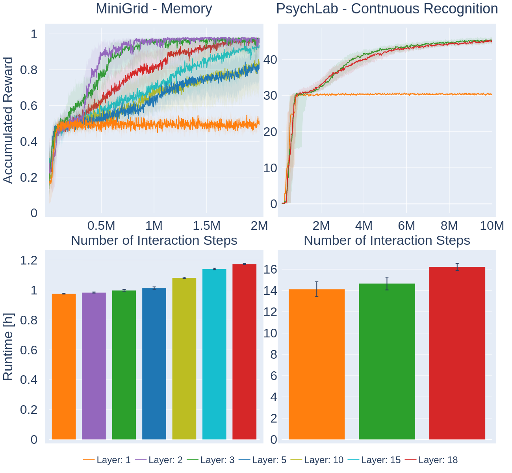

# Speeding up Semantic History Compression in Reinforcement Learning
> An improvement of the original [SHELM](https://github.com/ml-jku/helm) implementation which cuts the training time by up to 16% and removes 77% of parameters of the memory component while maintaining original performance.

This repository is the implementation of my Master's Thesis which aims to reduce the computational overhead of the [TrXL](https://huggingface.co/docs/transformers/main/en/model_doc/transfo-xl) used in [SHELM](https://github.com/ml-jku/helm).
The original codebase of SHELM was forked and extended to support [wandb](https://wandb.ai) logging and the possibility to set the number of layers of the [TrXL](https://huggingface.co/docs/transformers/main/en/model_doc/transfo-xl).

## Abstract
Partially observable environments in reinforcement learning are particularly challenging to solve because they require the agent to estimate the true state of the environment by maintaining a memory of past observations. Previous approaches employed LSTMs to achieve this abstraction. In contrast, Semantic History ComprEssion via Language Models in Reinforcement Learning (SHELM) utilises a pre-trained language transformer. It first retrieves language tokens from visual observations, which are then fed into a pre-trained language transformer to compress the past. 
The use of natural language in this context is based on the behaviour of humans, who also convey information in a compressed form to peers. 
Moreover, the use of a language model enables humans to check if crucial information entered the memory, increasing the interpretability of the AI agent. SHELM has been proven to deliver state-of-the-art performance in environments that require a memory component to solve. While it has already shown superior sampling efficiency compared to other approaches, a limitation of SHELM remains the time complexity introduced by the use of two large pre-trained transformer models during the rollout phase. 
In this thesis, we show that retaining only two of the original 18 layers of the pre-trained language transformer results in up to 16% faster training time, while maintaining the original performance. Furthermore, we attempt to explain why this pruned variant still performs on-par with the original SHELM by investigating the dynamics of different layers by looking at the attention weights of the language transformer.

## Research Question
- How many layers of the [TrXL](https://huggingface.co/docs/transformers/main/en/model_doc/transfo-xl) in SHELM can be pruned before the model performance degrades too much?
- What is the sweet spot between the number of layers and achieved performance?
- What are possible explanations for the observed results?

## Results
My work shows that a pruned TrXL can maintain the original performance and in certain environments even show better sample efficiency than the original 18-Layer variant.
Surprisingly, smaller variants with 2 or 3 layers perform better than variants with 5, 10 or 15 layers as shown in the figure below.
One likely explanation for this are the observed attention patterns of the second layer. This layer seems to capture more relevant information than subsequent layers and thus aid in solving the task in partial observable environments.
The notebooks for the result visualization and investigation can be found in the [results](./results) section. After download the necessary data with the provided [download script](./results/data/download_results.sh) the jupyter notebooks can be executed.

  

The tracked experiments can also be checked out in the corresponding [wandb project](https://wandb.ai/elba/Master-Thesis/table?nw=zglvzydk8v9)

## Reproduce Results
Please find more details for the installation at the [main repository](https://github.com/ml-jku/helm)

    git clone https://github.com/elba96/helm.git
    cd helm
    conda env create -f env.yml

To run the outlined experiments it is necessary to extract CLIP embeddings first by running:

    python prepare_embeddings.py

After installing the conda environment you can train HELM on the Memory environment by

    python main.py --config configs/MiniGrid/Memory/SHELM/config.json

A new directory `./experiments/SHELM/MiniGrid-MemoryS11-v0` will be created in which all log files and checkpoints will be stored.

If you wish to also log your experiments in wandb you can do so by

    python main.py --config configs/MiniGrid/Memory/SHELM/config.json --var wandb_api_key=<WANDB_API_KEY> --var wandb_entity=<WANDB_ENTITY> --var wandb_project=<WANDB_PROJECT> --var wandb_log=true

All changeable parameters are stored in the `config.json` file and can be adjusted via command line arguments as:

    python main.py --var KEY=VALUE

To change the number of layers with which the TrXL should be initialized specify:
    
    python main.py --var n_layer=5

For executing the results and investigation notebooks with interactive visualizations you will first have to download the provided data with samples episodes, training results of my experiments and more:

    cd results/data/
    ./download_results.sh

Afterward you are able to investigate the results in more detail.

--- 

## LICENSE
MIT LICENSE

---

If you find this work and code useful, please consider citing HELM,

    @InProceedings{paischer2022history,
      title = 	 {History Compression via Language Models in Reinforcement Learning},
      author =       {Paischer, Fabian and Adler, Thomas and Patil, Vihang and Bitto-Nemling, Angela and Holzleitner, Markus and Lehner, Sebastian and Eghbal-Zadeh, Hamid and Hochreiter, Sepp},
      booktitle = 	 {Proceedings of the 39th International Conference on Machine Learning},
      pages = 	 {17156--17185},
      year = 	 {2022},
      editor = 	 {Chaudhuri, Kamalika and Jegelka, Stefanie and Song, Le and Szepesvari, Csaba and Niu, Gang and Sabato, Sivan},
      volume = 	 {162},
      series = 	 {Proceedings of Machine Learning Research},
      month = 	 {17--23 Jul},
      publisher =    {PMLR},
      pdf = 	 {https://proceedings.mlr.press/v162/paischer22a/paischer22a.pdf},
      url = 	 {https://proceedings.mlr.press/v162/paischer22a.html},
      abstract = 	 {In a partially observable Markov decision process (POMDP), an agent typically uses a representation of the past to approximate the underlying MDP. We propose to utilize a frozen Pretrained Language Transformer (PLT) for history representation and compression to improve sample efficiency. To avoid training of the Transformer, we introduce FrozenHopfield, which automatically associates observations with pretrained token embeddings. To form these associations, a modern Hopfield network stores these token embeddings, which are retrieved by queries that are obtained by a random but fixed projection of observations. Our new method, HELM, enables actor-critic network architectures that contain a pretrained language Transformer for history representation as a memory module. Since a representation of the past need not be learned, HELM is much more sample efficient than competitors. On Minigrid and Procgen environments HELM achieves new state-of-the-art results. Our code is available at https://github.com/ml-jku/helm.}
    }
    
and SHELM

    @article{paischer2023semantic,
        author       = {Fabian Paischer and
                      Thomas Adler and
                      Markus Hofmarcher and
                      Sepp Hochreiter},
        title        = {Semantic {HELM:} An Interpretable Memory for Reinforcement Learning},
        journal      = {CoRR},
        volume       = {abs/2306.09312},
        year         = {2023},
        url          = {https://doi.org/10.48550/arXiv.2306.09312},
        doi          = {10.48550/arXiv.2306.09312},
        eprinttype    = {arXiv},
        eprint       = {2306.09312},
        timestamp    = {Mon, 19 Jun 2023 11:06:52 +0200},
        biburl       = {https://dblp.org/rec/journals/corr/abs-2306-09312.bib},
        bibsource    = {dblp computer science bibliography, https://dblp.org}
        }

